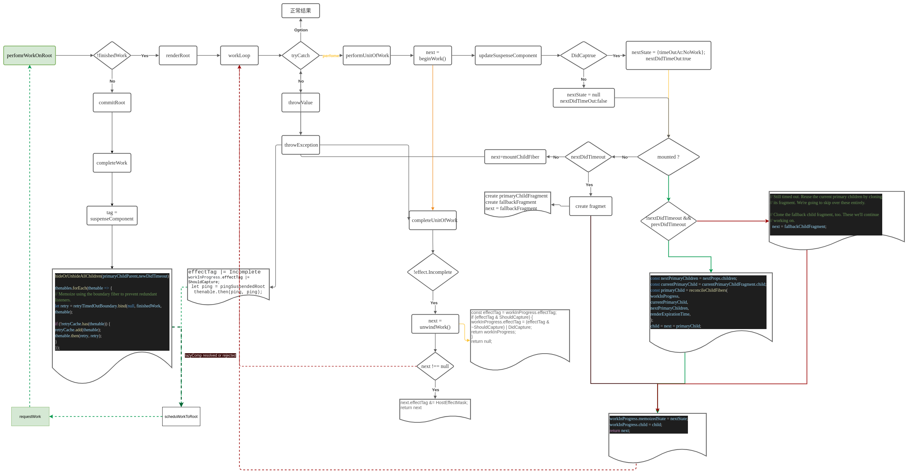

# react 源码 --- suspend

通常suspense组件和lazy组件组合,简单用法就是suspense组件提供fallback的loading和内部子组件lazy组成,其更新过程比较复杂

;
### 可分为 7 个阶段 才能把一个lazy组件挂在suspense组件上

1. 首次进入updaSuspenseComponent
  - 设置 nextState = null, nextDidTimeOut = false
  - mountChildFiber ,正常渲染,准备 throw throwValue
2. renderRoot的trycatch捕获到 throwValue
  - throwException
    + sourceFiber.effectTag |= Incomplete  ,clean effectList
    + sourceFiber.effectTag |= ShouldCapture
    + thenable.then(pingSuspendedroot)   pingSuspendedroot 准备接受lazy的返回值
  - nextUnitOfWork = completeUnitOfWork(sourceFiber)      
3. 进入 completeUnitOfWork
  - next = unwindWork (effectTag 去掉 ShouldCapture,添加 DidCapture,返回 sourceFiber)
  - next.effectTag |= HostEffectMask
  - return next  ==> workLoop --> 准备第二次进入 updaSuspenseComponent

4. 第二次进入updaSuspenseComponent
  - 设置 nextState = {timeOut:NoWork}, nextDidTimeOut = true,去掉 DidCapture
  - next = fallbackFragment
  - 渲染fallbackFragment,直至提交
5. commit
  - nextState.timeOut = requestCurrentTime()
  - hide primaryChildParent
  - thenable.then(retryTimeOutBoundary)  retryTimeOutBoundary 准备接受lazy的返回值
6. retryTimeOutBoundary 或者 pingSuspendedroot 响应了
  - addWorkToScheduler
  - requestWork =====> 准备第三次进入 updaSuspenseComponent
7. 第三次进入updaSuspenseComponent  
  - 通常情况下,这个时候子组件lazy组件已经返回,和普通组件一样,可以正常渲染
    + next = reconcileChildFibers (currentPrimaryChild)
  - 如果还有返回 
   + const nextFallbackChildren = nextProps.fallback,更新fallbackFragment,进入类似第5步  

### 流程图大概如下
   