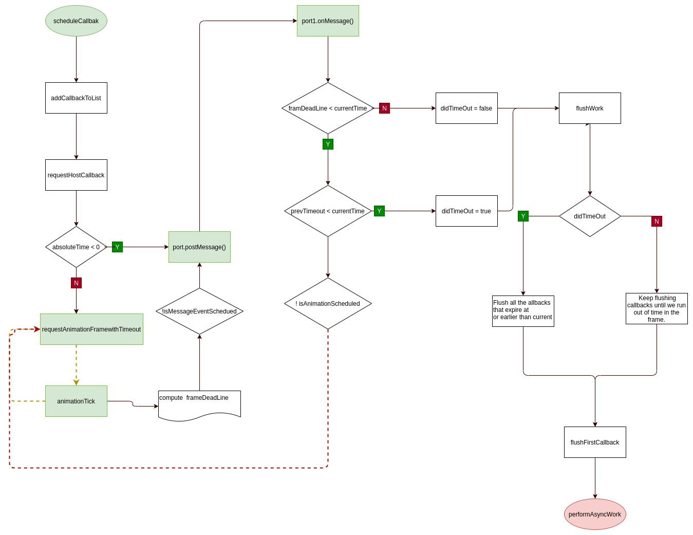

# react 源码初探之渲染流程 schedule

schedule 是 react 中处理异步任务的核心,本身的核心是利用浏览器的 RAF 来安排调度每个 requestWork 的机制;
首次读源码看到满满的全局变量难免一头雾水,本人先把 react 其他方面的源码看完,再回过头来看本节的内容瞬间清晰多了.废话少说,直接看流程

### 再言

这部分代码其实主要是 RAF 和 animationTick 配合,实现不停循环每一帧调一次 animationTick,经各种条件曲折的道路,最终都走向 port.postMessage,从而 推到第二核心块 post1.onMessage 方法;所以以下内容只要围绕这几个点看就很容易明白

先看看 MessageChannel,记住它

```js
 var channel = new MessageChannel();
 var port = channel.port2;
 channel.port1.onmessage = () => // 后面分析见
```

### 进入整体,从 scheduleCallback 开始

1. scheduleCallback,该方法 主要做两件事

- 创建新的 newCallbackNode ,并将其加入 CallbackList 中
- 开始调度,即 ensureHostCallbackIsScheduled --> requestHostCallback --> requestAnimationFrameWithTimeout
- 注意:requestHostCallback 内部的 scheduledHostCallback = flushWork

```js
function ensureHostCallbackIsScheduled() {
  if (isExecutingCallback) {
    // Don't schedule work yet; wait until the next time we yield.
    return;
  }
  // Schedule the host callback using the earliest expiration in the list.
  var expirationTime = firstCallbackNode.expirationTime;
  if (!isHostCallbackScheduled) {
    isHostCallbackScheduled = true;
  } else {
    // Cancel the existing host callback.
    cancelHostCallback();
  }
  requestHostCallback(flushWork, expirationTime);
}

requestHostCallback = function (callback, absoluteTimeout) {
  scheduledHostCallback = callback;
  timeoutTime = absoluteTimeout;
  if (isFlushingHostCallback || absoluteTimeout < 0) {
    // Don't wait for the next frame. Continue working ASAP, in a new event.
    port.postMessage(undefined);
  } else if (!isAnimationFrameScheduled) {
    // If rAF didn't already schedule one, we need to schedule a frame.
    // TODO: If this rAF doesn't materialize because the browser throttles, we
    // might want to still have setTimeout trigger rIC as a backup to ensure
    // that we keep performing work.
    isAnimationFrameScheduled = true;
    requestAnimationFrameWithTimeout(animationTick);
  }
};
```

2. animationTick 方法内部在适合的条件继续掉 requestAnimationFrameWithTimeout,该方法另外两个主要功能是

- 计算新的 frameDeadLine
- 调用 port.postMessage

```js
var animationTick = function (rafTime) {
  if (scheduledHostCallback !== null) {
    requestAnimationFrameWithTimeout(animationTick);
  } else {
    // No pending work. Exit.
    isAnimationFrameScheduled = false;
    return;
  }

  var nextFrameTime = rafTime - frameDeadline + activeFrameTime;
  if (nextFrameTime < activeFrameTime && previousFrameTime < activeFrameTime) {
    if (nextFrameTime < 8) {
      nextFrameTime = 8;
    }
    activeFrameTime =
      nextFrameTime < previousFrameTime ? previousFrameTime : nextFrameTime;
  } else {
    previousFrameTime = nextFrameTime;
  }
  frameDeadline = rafTime + activeFrameTime;
  if (!isMessageEventScheduled) {
    isMessageEventScheduled = true;
    port.postMessage(undefined);
  }
};
```

3. channel.port1.onmessage 方法,该方法的功能很简单,就是计算 didTimeOut

- 注意:scheduledHostCallback 为上面提到的 flushWork,
- 该方法 得出一个新的 didTime 给 flushWork

```js
channel.port1.onmessage = function (event) {
  isMessageEventScheduled = false;

  var prevScheduledCallback = scheduledHostCallback;
  var prevTimeoutTime = timeoutTime;
  scheduledHostCallback = null;
  timeoutTime = -1;

  var currentTime = getCurrentTime();

  var didTimeout = false;
  if (frameDeadline - currentTime <= 0) {
    // There's no time left in this idle period. Check if the callback has
    // a timeout and whether it's been exceeded.
    if (prevTimeoutTime !== -1 && prevTimeoutTime <= currentTime) {
      // Exceeded the timeout. Invoke the callback even though there's no
      // time left.
      didTimeout = true;
    } else {
      // No timeout.
      if (!isAnimationFrameScheduled) {
        // Schedule another animation callback so we retry later.
        isAnimationFrameScheduled = true;
        requestAnimationFrameWithTimeout(animationTick);
      }
      // Exit without invoking the callback.
      scheduledHostCallback = prevScheduledCallback;
      timeoutTime = prevTimeoutTime;
      return;
    }
  }

  if (prevScheduledCallback !== null) {
    isFlushingHostCallback = true;
    try {
      prevScheduledCallback(didTimeout);
    } finally {
      isFlushingHostCallback = false;
    }
  }
};
```

4. flushWork 方法也很简单,主要根据 didTimeout 不同的值处理不同的任务:

- didTimeOut 为 true 的处理所以过时的任务
- didTimeOut 为 false 事处理所有未过时任务在这一帧内
- 不管哪个任务执行的都是 flushFirstCallback 方法,主要是获取 firstCallback 并调用其 Callback,也就是react里的performAsyncWork,同时删除该节点,更新 CallbackList

### schedule的流程图
