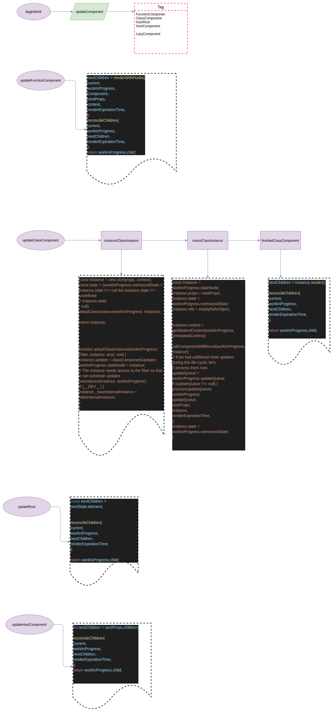

# react源码初探之渲染流程(5)

> 这个小节主要是介绍beginWork,completeUnitOfWork阶段详细情况
> 把commitRoot顺便放进去

### 概要
结合前文的performWorkOnRoot,其工作流程是先render后commit;
render阶段包含创建或者更新fiber,标记effectTag并归并收集到root,在commit的阶段分类执行

### render阶段

- beginWork,主要做是 updateComponent,有两个步骤
  + update or mount,create fiber,从上往下,打 EffectTag
  + completeUnitOfWork,归并自己的effectList 到 return节点,从下往上进行

### commit 阶段
- commitMutationBeforeUpdate,执行 getSnapShotBeforeUpdate,FuncComp会执行effect.create() 
- commitAllHostEffect,执行effect上的 update,placement,deletion
- commitAllLifecycle
  + willMount,willUpdate
  + willRecieveProps

### 各个Tag对应的update流程
